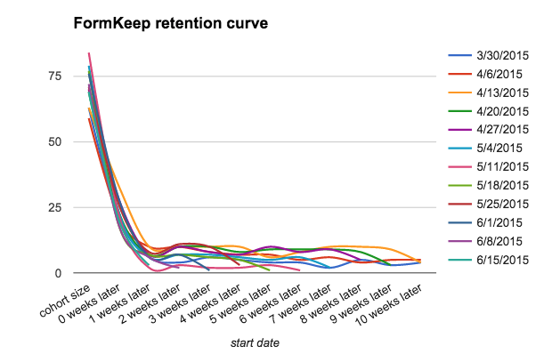
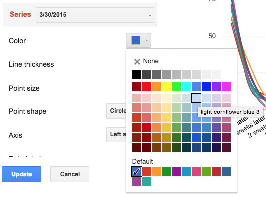

# Retention Curves with Mixpanel and Google Sheets

Product retention is often measured using cohort reports with tools such as
Amplitude, Google Analytics, iTunes Connect Analytics, or Mixpanel.

Most of the time, these cohort reports come in tabular form.
My experience is those reports can be confusing.
An alternative visualization is a retention curve.

[Amplitude][amp] and [Google Analytics][an]
provide retention curves for acquisition and behavioral cohorts
"out of the box".
If we're using Mixpanel,
we can export data to [Google Sheets][sh]
and generate a retention curve there.

[amp]: https://amplitude.com/blog/2015/11/24/cohorts-to-improve-your-retention/
[an]: https://support.google.com/analytics/answer/6074676?hl=en
[sh]: https://docs.google.com/spreadsheets/u/0/

We'll use real data from
[FormKeep](https://formkeep.com),
product that provides form endpoints for folks working on static sites
who don't want to fight with trying to style iframes or JavaScript embeds.

## Setting up the curve

Sign into Mixpanel.
Click "Retention" in the left sidebar.
Click "First Time" at the top of the page.
For "Show me people who did", select an activation event such as "Signed Up".

For "Then came back and did", select a [North Star metric][ns]
(the activity where users are getting authentic value from the product).
Choose "Day", "Week", or "Month" based on the expected frequency of that event.

[ns]: north-star-metric

Click the "CSV" download button in the bottom right.
Go to Google Sheets.
Create a new spreadsheet.
Click "File > Import > Upload".
Select the file.
Select "Replace spreadsheet".

Select all the data.
Click "Insert > Chart".
Click "Chart types",
"Switch rows / columns",
and the curvy "Line" chart type (for style).
Click "Customization" to edit the title.

Select each time series,
and pick a shade of color in the same column,
making the oldest time series the lightest shade.

The goal of this shading to create a relationship between the series.
Darker is more recent ("fresh paint")
and lighter is older ("faded").

## Analyzing FormKeep's curves

[In every product's activation funnel][chen],
the curves will flatten out.

[chen]: http://andrewchen.co/new-data-shows-why-losing-80-of-your-mobile-users-is-normal-and-that-the-best-apps-do-much-better/

A product with improving retention will have
darker-colored lines (more recent cohorts)
flatten sooner, for longer, and for a higher absolute amount,
than lighter-colored lines (older cohorts).

FormKeep's curves are experiencing a sharp drop-off in the first two weeks.
The people who do activate, stay activated for months, though.
So, the [growth team][gr]
should work on better activation to set users up for success.

[gr]: https://brianbalfour.com/essays/growth-vs-marketing-vs-product

This isn't super surprising.
FormKeep is a "free to sign up" product that require some set up
(HTML to be added to a site) to activate.

## Analyzing Upcase's curves

Let's compare the retention curves of another real product,
[Upcase](https://thoughtbot.com/upcase/join),
an online training community for programmers.

The initial drop-off in usage is shallower than FormKeep's.
Where FormKeep's cohorts are closer to 10% active in weeks one and two,
Upcase's cohorts are more like 30-40% active in weeks one and two.

There is a trend of older cohorts stopping use of the product
3-4 weeks after subscribing,
and recent cohorts sticking around a bit longer, closer to 6 weeks.
This is good news, and validates a recent focus on content production.

Unlike FormKeep,
Upcase is "pay to sign up",
so we'd intuitively expect more motivated users,
especially in the first month.

## Time to segment

These charts give us a scorecard,
but also some clues about where to dig for more data.
For example, maybe [Intercom](https://www.intercom.com) communication to users
should be adjusted around weeks 1-2.

It's also a reminder that the more properties we send
to Mixpanel for our activation event,
the more information we have on different segments,
which could give us other clues about who is and isn't getting value.
Click "+ Segment" in Mixpanel
and choose an important property to segment by,
such as user acquisition channel:

Each segment can have its own retention curve.
