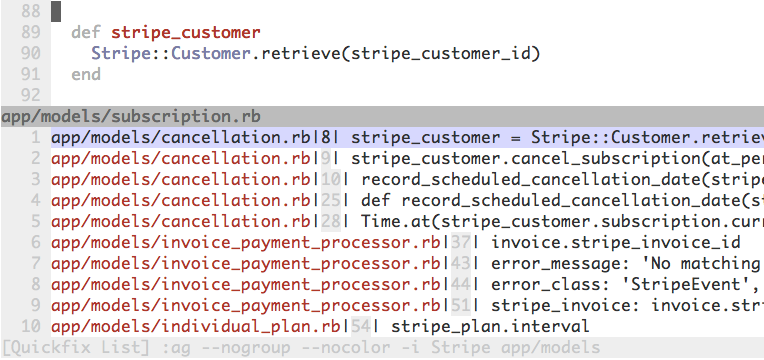

# Search Projects in Vim

Projects can be searched for specific text within Vim:

```
:grep sometext
```

Can we `grep` faster?

## Override to use The Silver Searcher

`grep` is a built-in command of Vim.
By default, it will use the system's `grep` command.
We can overwrite it to use
[The Silver Searcher](https://github.com/ggreer/the_silver_searcher)'s
`ag` command by putting this in
[our `~/.vimrc`](https://github.com/statusok/statusok/blob/master/dotfiles/editor/vimrc):

```vim
" The Silver Searcher
if executable('ag')
  " Use ag over grep
  set grepprg=ag\ --nogroup\ --nocolor

  " Use ag in CtrlP for listing files. Lightning fast and respects .gitignore
  let g:ctrlp_user_command = 'ag %s -l --nocolor -g ""'

  " ag is fast enough that CtrlP doesn't need to cache
  let g:ctrlp_use_caching = 0
endif
```

## Search for the word under the cursor

This searches for the text under the cursor
and shows the results in a "quickfix" window:

```vim
" bind <Leader>k to grep word under cursor
nnoremap <Leader>k :grep! "\b<C-R><C-W>\b"<CR>:cw<CR>
```

It looks like this when `<Leader>k`
is typed with the cursor over `SubscriptionMailer`:


Cursor over each search result, hit `Enter`, and the file will be opened.

## Using `ag` arguments

This defines a new command `Ag` to search for the provided text
and open a "quickfix" window:

```vim
" bind \ (backward slash) to grep shortcut
command -nargs=+ -complete=file -bar Ag silent! grep! <args>|cwindow|redraw!
```

Map it to any character, such as `\`:

```vim
nnoremap \ :Ag<SPACE>
```

When `\` is pressed, Vim waits for input:

```vim
:Ag
```

Standard `ag` arguments may be passed in at this point:

```vim
:Ag -i Stripe app/models
```

Hitting `Enter` results in:


